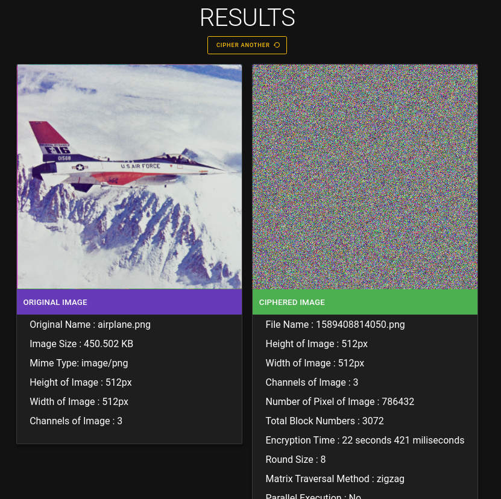
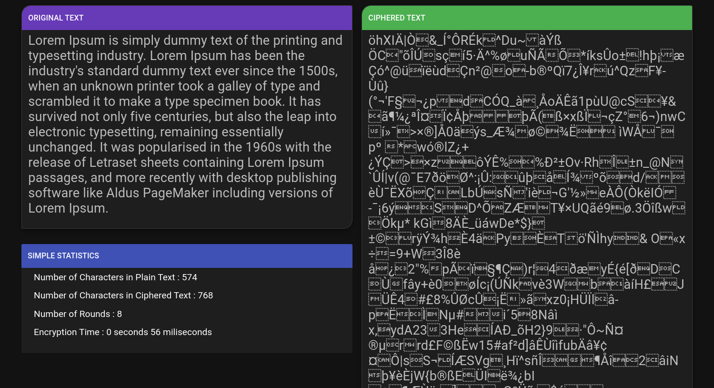
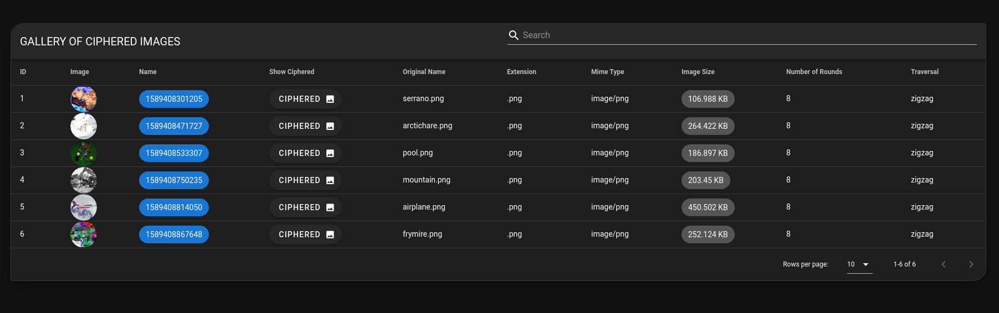

# An Image Encryption Algorithm Based on Chaotic Selection of Robust Cryptographic Primitives
## Introduction
This project involves the implementation of an encryption algorithm. The main purpose of the encryption algorithm is image encryption, but it can be successfully encrypted in the text with the same algorithm.

In order to provide easy understanding of the encryption algorithm, the algorithm has been designed to be tested on a website.
Within the scope of the project, the S-Box structures of the AES algorithm and DES algorithm are used in addition to the SHA3 algorithm.
* For more details, you can review the [IEEE Page](https://ieeexplore.ieee.org/abstract/document/9044816)  

> Also you can look at [Documentation of Algorithm Codes](static/out/index.html) 
### Example Input and Output
 
## Project Interfaces
### Image Encryption

* Supported Mime Types
    - image/jpeg
    - image/png
    - image/tiff
    - image/webp
### Text Encryption

### Gallery


## Getting Started
>If you just want to look at the algorithm codes, you can examine the lib folder.
### Prerequisites
* The project was created using [Node.js](https://nodejs.org/). 
* A NodeJS and NPM must be installed on your local computer to start the project.


Example Installation for Ubuntu and Debian.
```bash
# Using Ubuntu
curl -sL https://deb.nodesource.com/setup_13.x | sudo -E bash -
sudo apt-get install -y nodejs

# Using Debian, as root
curl -sL https://deb.nodesource.com/setup_13.x | bash -
apt-get install -y nodejs
```
If you are using other platforms, you can use this link. [NodeJS Download](https://nodejs.org/en/download/)
### Installing
Install the dependencies.
```bash
# Clone the repo
$ git clone https://github.com/0xcmdr/encryption-algorithm-demo.git

# Install required node modules
$ yarn install

# OR 
$ npm install
```

## Deployment

Initalize Project Fils and Launch Development Server
```bash
$ yarn dev

# OR

$ npm run dev
```
> After this process, you can access the website via http://localhost:3000
## Built With

* [NodeJS](https://vuejs.org) - The Progressive JavaScript Framework
* [VueJS](https://vuejs.org) - The Progressive JavaScript Framework
* [NuxtJS](https://nuxtjs.org/) - Universal Vue.js Application built with Nuxt.js
* [ExpressJS](https://github.com/expressjs/express) - Fast, unopinionated, minimalist web framework for node.
* [NumJS](https://github.com/nicolaspanel/numjs) - Like NumPy, in JavaScript

## Contributing
Pull requests are welcome. For major changes, please open an issue first to discuss what you would like to change.

## Roadmap
* v0.1.0 (Completed)
    - Des/Aes Shifting S-Box (Completed)
    - Random Number Generator (Completed)
    - Zigzag Matrix Traversal (Completed)
    - Algorithm Code (Completed)
    - Image Cipher (Completed)
    - Text Cipher (Completed)
* v0.1.1 (Ongoing)
    - CKG Function
    - Row-Wise Matrix Traversal
    - Column-Wise Matrix Traversal
    - Spiral Order Traversal of a Matrix
    - Array Speed Optimizations
* v0.1.2 (Pending)
    - Image Decryption
    - Text Decryption
    
* Also Online Demo is Coming Soon

## License
[MIT](https://choosealicense.com/licenses/mit/)

## Acknowledgments

Thanks to [Fatih Özkaynak](https://ieeexplore.ieee.org/author/38228769600), for his contribution.

